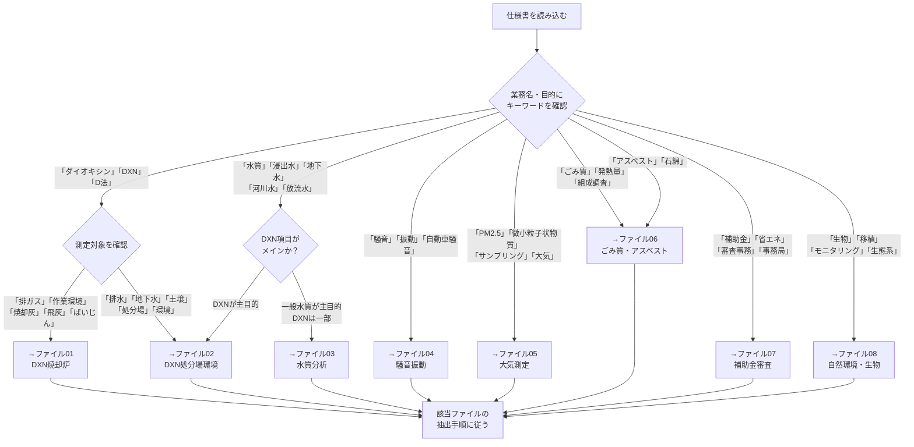

# 仕様書読み解き標準マニュアル【マスターインデックス】
## AIエージェント（Copilot）向け 見積積算データ抽出・比較ガイド

> **バージョン**: 2.0  
> **最終更新**: 2026-03-31  
> **対象**: 環境計量・測定系、行政事務系、自然環境系の各種委託業務

---

## ファイル構成

| ファイル番号 | ファイル名 | 対象業務カテゴリ | 主な業務種別例 |
|------------|-----------|----------------|------------|
| **共通** | `00_マスターインデックス.md`（本ファイル） | 全業務共通 | 業務種別判定・共通ルール |
| **01** | `01_環境計量_DXN測定_焼却炉.md` | ダイオキシン類測定（焼却炉系） | 排ガス・焼却灰・飛灰・作業環境測定 |
| **02** | `02_環境計量_DXN測定_処分場環境.md` | ダイオキシン類測定（処分場・環境系） | 放流水・地下水・土壌・排水のDXN |
| **03** | `03_環境計量_水質分析.md` | 水質分析・検査 | 浸出液処理水・地下水・河川水・保有水 |
| **04** | `04_環境計量_騒音振動.md` | 騒音・振動調査 | 廃棄物施設の騒音振動・自動車騒音常時監視 |
| **05** | `05_環境計量_大気測定.md` | 大気測定 | PM2.5成分分析用サンプリング |
| **06** | `06_環境計量_ごみ質_アスベスト.md` | ごみ質・アスベスト調査 | ごみ質分析・アスベスト定性分析 |
| **07** | `07_行政事務_補助金審査.md` | 補助金審査・交付事務局運営 | 住宅用エネルギー・省エネ設備補助金 |
| **08** | `08_自然環境_生物調査.md` | 自然環境・生態系調査 | 生物移植・モニタリング |

---

## 業務種別の自動判定フロー



---

## 全業務共通の抽出ルール

### 1. 履行期間の読み取り（全業務共通）

| 表現パターン | 解釈 | 記録方法 |
|------------|------|---------|
| `令和X年Y月Z日まで` | 終了日が明確 | 西暦変換してISO形式 |
| `契約締結日の翌日から〜まで` | 開始日が契約次第 | 開始日=`UNKNOWN`、終了日を記録 |
| `令和X年X月X日から令和Y年Y月Z日まで` | 開始・終了ともに明確 | 両方ISO形式 |

**令和→西暦変換表（頻出）**:

| 令和 | 西暦 |
|------|------|
| 令和6年 | 2024年 |
| 令和7年 | 2025年 |
| 令和8年 | 2026年 |
| 令和9年 | 2027年 |

### 2. 契約方式の確認（全業務共通）

| 契約方式 | 特徴 | 積算への影響 |
|---------|------|------------|
| **単価契約** | 件数・回数に応じて支払い | 単価×予定数量で見積もる。予定件数の変動リスクに注意 |
| **請負契約（一式）** | 業務完了で支払い | 総額で見積もる |
| **随意契約** | 記載なし | 契約書形式を確認 |

### 3. 成果品・報告書の共通チェック項目

```
□ 紙報告書の部数
□ 電子データの要否（PDF / Word / Excel / GIS）
□ 提出期限（採取後〇日以内 / 翌月末 / 年度末）
□ 速報の要否
□ 計量証明書の添付要否
□ 写真の添付要否・要件
□ 様式の指定（本市指定様式 / 任意様式）
□ しおり付きPDFの要求
□ ウイルスチェック記録の添付
```

### 4. 個人情報・守秘義務（全業務共通）

ほぼ全仕様書に記載あり。補助金審査業務は**個人情報保護**の要件が特に厳格。
- 「個人情報・情報資産取扱特記事項」への準拠が別途求められる場合がある
- 成果品の著作権帰属先を必ず確認する（発注者帰属が標準）

---

## データID体系（全業務共通）

```
{業務カテゴリコード}-{西暦4桁}-{連番3桁}

業務カテゴリコード:
  DXN_FUR  : ダイオキシン類測定（焼却炉系）
  DXN_ENV  : ダイオキシン類測定（処分場・環境系）
  WATER    : 水質分析
  NOISE    : 騒音・振動
  AIR      : 大気測定
  WASTE    : ごみ質・アスベスト
  SUBSIDY  : 補助金審査事務
  BIO      : 生物・生態系
```

---

## 改訂履歴

| バージョン | 日付 | 内容 |
|-----------|------|------|
| 1.0 | 2026-03-31 | 初版（環境計量8業務種別） |
| 2.0 | 2026-03-31 | PM2.5・補助金審査・生物移植・DXN排ガス以外を追加。業務種別ごとにファイル分割 |
